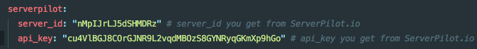
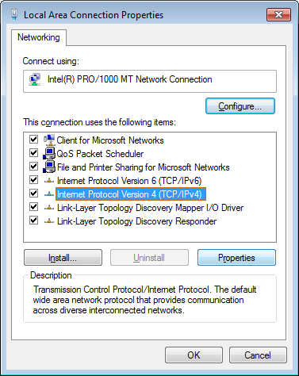

## Setup ServerPilot with Vagrant

This repository provides a better way to install Vagrant w/ ServerPilot. After following the installation instructions, you'll have a server managed by ServerPilot and accessible via your browser at `anything-you-want-to`.

https://serverpilot.io

## Information
You will be able to setup as many domain as you want. And a better, faster stack for developing Magento 2

## Getting Started
1. Install dependencies
  * [Virtualbox](https://www.virtualbox.org/) 5.0 or greater.
  * [Vagrant](http://downloads.vagrantup.com/) 1.8.3 or greater.
2. Clone this [repository](https://github.com/nntoan/vagrant-serverpilot)
3. Change the settings in [settings.yml](https://github.com/nntoan/vagrant-serverpilot/blob/master/settings.yml) to fit your needs (before go to step 4, check [this]() first)
4. Execute the following commands to setup the virtual machine : (check [this](https://github.com/nntoan/vagrant-serverpilot#connecting-to-serverpilot) before execute commands below)
```bash
$ vagrant up
$ vagrant ssh
```

## Connecting to ServerPilot
  * [Log in](https://manage.serverpilot.io/#login) to ServerPilot
  * Go to the **Servers** page and click **+ Connect Server**
  * Click `I don't have a root password or public IP address` at the bottom
    * `Hostname` => `Anything you want`
    * `SFTP Password` => `Choose a password`
    * `Enable SSH password authentication if it's current disabled` (uncheck if you don't want to use password)


  * Copy server-id and server-api-key in the command ServerPilot generated into `settings.yml`


  * Your `settings.yml` will look like this :


  * Watch **ServerPilot** install

  * **Note** : The part `Testing server configuration` **may take several minutes** (3-5 minutes based on your Internet connection's moods)
  * Your console will look like this while installing

  * Your console will look like this after finished


## Create your Applications in ServerPilot
  * Go to the **Apps** (or **Servers**) page and click **+ Create App**
    * `Name` => `anything-you-want`
    * `Domain` => `anything.domain`
    * `Runtime` => `choose-your-php-version` (such as 5.6)
    * `Server` => `your-newly-created-server`


## Create Database for your Applications
  * Navigate to your application, change to **Databases**
  * Click to **+Create Database**
    * `Name` => `anything-you-want`
    * `Username` => `<generated>`
    * `Password` => `<generated>` (should copy to somewhere because you can't change it via GUI)


## Edit the `hosts` file
  * Edit the following file as `administrator` / `root`
    * Linux/Mac OS X : `/etc/hosts`
    * Windows : `C:\WINDOWS\system32\drivers\etc\hosts`
  * Add the following code in this file :
    * `<your-private-ip> anything.domain`

## Enjoy
  * Go to [anything.domain](http://anything.domain) in a new tab and you should see the ServerPilot splash page **or** your application.


# More Configuration
The following configuration are not required, but could be useful some day.

### Dnsmasq (*nix)
[Dnsmasq](http://www.thekelleys.org.uk/dnsmasq/doc.html) is a very well-known package in *nix world (Mac OS X is Unix, Ubuntu is Linux).
It provides network infrastructure for small networks such as DNS, DHCP, router advertisement and network boot.
If you need to point a domain to a specified IP address like *.dev*, *.local*, *.xxx* to *127.0.0.1*, you will need Dnsmasq!
  * **Ubuntu tutorials**
    * http://manpages.ubuntu.com/manpages/xenial/man8/dnsmasq.8.html
    * https://gist.github.com/magnetikonline/6236150
  * **Mac OS X tutorials**
    * https://passingcuriosity.com/2013/dnsmasq-dev-osx/
    * https://gist.github.com/ogrrd/5831371


### Acrylic DNS (Windows folks)
Are you tired by changing your hosts file all the time? Do you want to config your hosts file once and never touch it again?
Then ladies and gentlemen, I present to you: [Acrylic DNS - an alternative Dnsmasq for Windows](http://mayakron.altervista.org/wikibase/show.php?id=AcrylicHome).
  * **Windows instructions**
    * Download & install the package you find in the link above for your Windows 7/8/10
    * In your [Acrylic config file](http://mayakron.altervista.org/wikibase/show.php?id=AcrylicConfiguration) :
      * Find `PrimaryServerAddress=8.8.8.8` and replace `8.8.8.8` to your primary DNS server you'd like
      * Find `SecondaryServerAddress=8.8.4.4` and replace `8.8.4.4` to your secondary DNS server you'd like
    * In your [Acrylic host file](http://mayakron.altervista.org/wikibase/show.php?id=AcrylicHosts) :
      * Add `<your-private-ip> *.domain` to the end of file (replace *.domain* to whatever you want such as *.local*)
    * Access the properties of your Internet connection, then access the properties of the Internet Protocol Version 4 (TCP/IPv4) item

    * Select the Use the following DNS server addresses option and set the value of the Preferred DNS server field to 127.0.0.1. Then click on the OK button.

    * Purge DNS cache by go to **Start Menu\Acrylic DNS Proxy\Config\Purge Acrylic Cache Data**
    * DONE!


### Connect to the `SFTP`
Yes, you can connect to the server using the SFTP method !
  * Use your prefered software. I will use `Transmit`.
  * Login in Transmit with the following credentials :
    * `Host` => `<your-private-ip>`
    * `User` => `serverpilot`
    * `Password` => `The SFTP password that you provided at the beginning of this tutorial`
    * `Port` => `22`
  * You can also login with the `ubuntu` user :
    * `Host` => `<your-private-ip>`
    * `User` => `ubuntu`
    * `Password` => `ubuntu`
    * `Port` => `22`
  * But **I recommend** you to use the `serverpilot` user and not the `vagrant`, else you will probably have some permissions issues (i.e : https://serverpilot.io/community/articles/how-to-fix-file-permissions.html)

